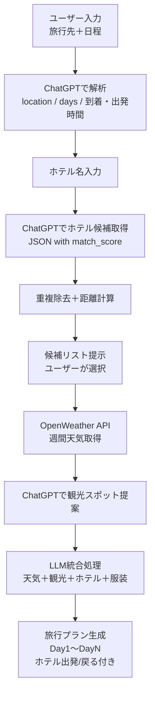

# 🛠 改良の流れまとめ

## ① **基本機能の実装**
- OpenWeather API → **週間天気予報取得**  
- ChatGPT → **観光スポット・料理の提案**  
- ユーザー入力から `location, days, arrival_time, departure_time` を抽出  
- LLM に渡して **旅行プラン生成**

---

## ② **服装アドバイス追加**
- 天気・気温から LLM が **服装（半袖/長袖/コート/レインコート）** を自動判定  

---

## ③ **フライト時間考慮**
- 初日: 到着時刻以降のみプラン  
- 最終日: 出発時刻−1時間まで活動  

---

## ④ **ホテル情報の組み込み**
- 宿泊ホテル名を入力  
- プランに「ホテル出発」「ホテルに戻る」を組み込み  

---

## ⑤ **ホテル候補の曖昧検索**
- ChatGPT で **ホテル候補リスト(JSON)** を取得  
- 類似度スコア（0.0〜1.0）付き  

---

## ⑥ **候補の重複除去**
- 名前の揺れ（例: フサキビーチリゾート / フサキリゾート）＋近い座標は同一と判定  

---

## ⑦ **距離＋類似度スコア導入**
- `final_score = match_score - (distance_km / 20)`  
- 類似度が高く、かつ物理的に近いホテルが上位に来る  

---

## ⑧ **候補リストの精緻化**
- 重複除去＋スコア順ソート  
- 表示例:  
  ```
  1. フサキビーチリゾート - 石垣市宇根2435 (score: 1.0, dist: 0.0km, final: 1.0)
  2. アートホテル石垣島 - 石垣市大川462 (score: 0.7, dist: 1.92km, final: 0.604)
  3. グランヴィリオリゾート石垣島 - 石垣市浜崎町3-6 (score: 0.7, dist: 3.76km, final: 0.512)
  ```

---

# 📊 図解フロー（Markdown）



---

## ✅ 現在の完成度
- 旅行日程入力からホテル選択 → 天気/観光情報取得 → プラン生成まで一貫  
- ホテルは **名前の曖昧検索＋距離考慮＋重複排除** で安定  
- プランには **天気/服装/観光/地元料理/フライト時間制約** が反映済み  
